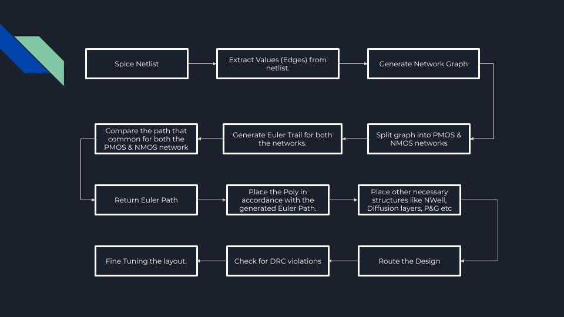
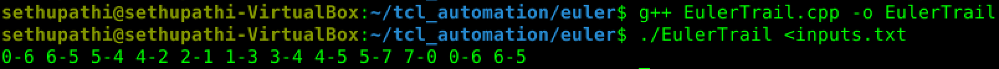

# Layout Generator

This repository cointains source code that converts a spice netlist (digital) to its corresponding layout. The layout is generated using the Open Source Tool named Magic. Here, **fn.sp** contains the spice netlist of the function **Y = ~[(B+D).(A+C)+(E.F)].** 
We're trying to automatically generate layout for this boolean fuction. This project is initially built for digital circuits and later to be scaled/modified for analog circuits. 

**The project is in a very early stage and might not yet be ready for productive use.**

**Assumptions** -- The Design Engineer/Characterization Engineer has designed the circuit and performed the circuit simulations and has generated the spice netlist. A tutorial on how to perform circuit simulations using **ngspice** can be found [**here**](https://github.com/sherylcorina/avsdbgp_3v3). 

A very brief description of this project can be found [**here**](https://www.vlsisystemdesign.com/ip/). This work has been carried out by going through Mr. Kunal Ghosh's lecture on Custom Layout. You can have a look at the course [**here**](https://www.udemy.com/course/vlsi-academy-custom-layout/).

**Note** -- There are some pre-requisites to understand/reproduce this project.

1. Working Knowledge of Data Structures and Algorithms in any programming language. I have used C++ here. 
2. Knowledge of Graphs.
3. Knowledge of grep/awk/sed & tcl.

You can get proficient in programming by following the steps given [**here**](https://medium.com/@sethupathibalakrishnan/my-experiences-on-anything-and-everything-in-life-231eb4699609) in the Competitive Programming Section. A tutorial on finding the Euler Path can be found [**here**](https://www.youtube.com/watch?v=8MpoO2zA2l4&t=11s).
The layouts are drawn using Magic Layout Tool. Installation instructions can be found [**here**](https://www.udemy.com/course/vsd-a-complete-guide-to-install-open-source-eda-tools/).
## Conventional Work Flow

<p align="center">
  
</p>

It takes enormous amount of time to calculate the positions of each component like distance between the poly, total height & width of the cell, spacing between the cells etc and draw the layout adhering to the DRC rules.
This project is an attempt to reduce the **Engineering Effort** that is put in drawing the layout. 

## Layout Generation Engine (An abstract flow diagram)

<p align="center">
  
</p>

A brief document on this layout_generator flow can be found [**here**](Documentation/Layout_generator.pdf). 

## Details

Step 1 -- Extract edges/node information from the spice netlist.
The edges and node details are extracted from the Netlist using grep+awk+sed. (There is some work that is to be done here).
The shell script to extract the node/edge details can be found [**here**](Source_Code/read_spice.sh). 
The extracted file has to be further processed to feed the algorithm to get the Euler Trail. (Work Pending)

Step 2 -- Feed the extracted file to the Euler Trail finding algorithm. Source code for the algorithm can be found [**here**](Source_Code/EulerTrail.cpp).
The algorithm takes majorly 2 values. They are -->
1. Total number of edges.
2. The Edge List.

Command to run the algorithm is as follows.
```
$  g++ EulerTrail.cpp -o EulerTrail
```

```
$  ./EulerTrail < inputs.txt
```

You get the following output. This is the Euler Path for the combined graph
<p align="center">
  
</p> 

   
 ##  Pending Work
 
 - The file conversion needs to be worked upon. 
 - Graph Splitting. Need to go through this. It's very important. As of this moment, the algorithm only returns the Euler Path for the Combined (PMOS + NMOS) graph.  
 - Layouting.
 - Routing the Layout. (This seems to an extremely difficult task mainly because it is done after placing the poly's in the design)
 - Pass Transistor's. Layouting for pass transistor logic is a bit complicated as it requires adding dummy nodes/edges and forming the graph.
 - Random Graph Generator (This is important for testing the algorithm)
 - To know more about bridges and articulation points in a graph. 
 - I need to solve a lot of problems and get to know about some advanced concepts like Dynamic Programming and Memoization applied on graphs.

## Note

 - A usable version of this software is available [**here**](https://codeberg.org/tok/librecell). It has been developed by Thomas Kramer. (PhD @ ETH-Zurich).
 - This objective of this project is to replicate the work done by Thomas thereby getting an exponential learning curve.
 - The usage of the tool is quite basic. However, developing the entire toolchain from scratch was a major challenge. 
 - A CS grad can crack this problem with a little effort. However, I am not from CS. Hence, it took me a lot of time to get acquainted with CS concepts.
 - The usage of the tool is quite basic. However, developing the entire toolchain from scratch was a major challenge. 
 
## Author

**Sethupathi Balakrishnan**

## Acknowledgments
- Philipp
- Kunal Ghosh

Contact Information
===================================
- SETHUPATHI BALAKRISHNAN
